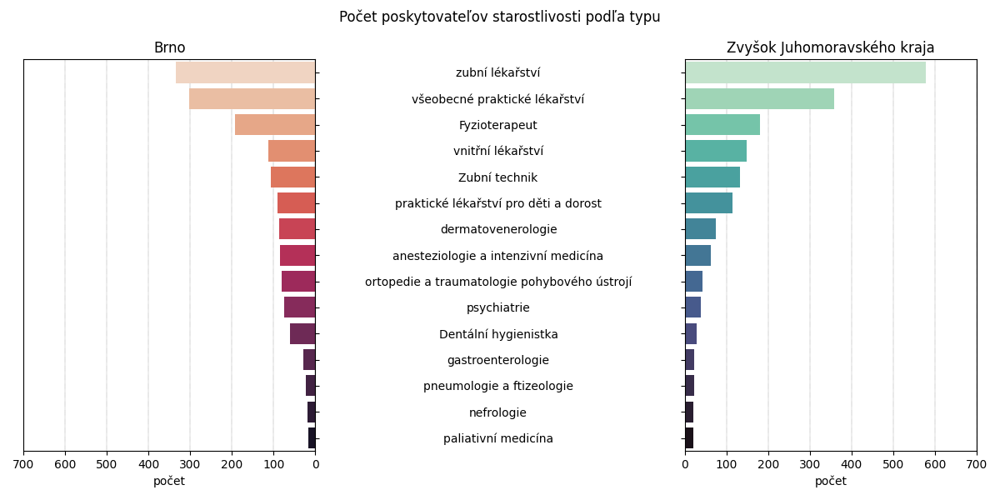
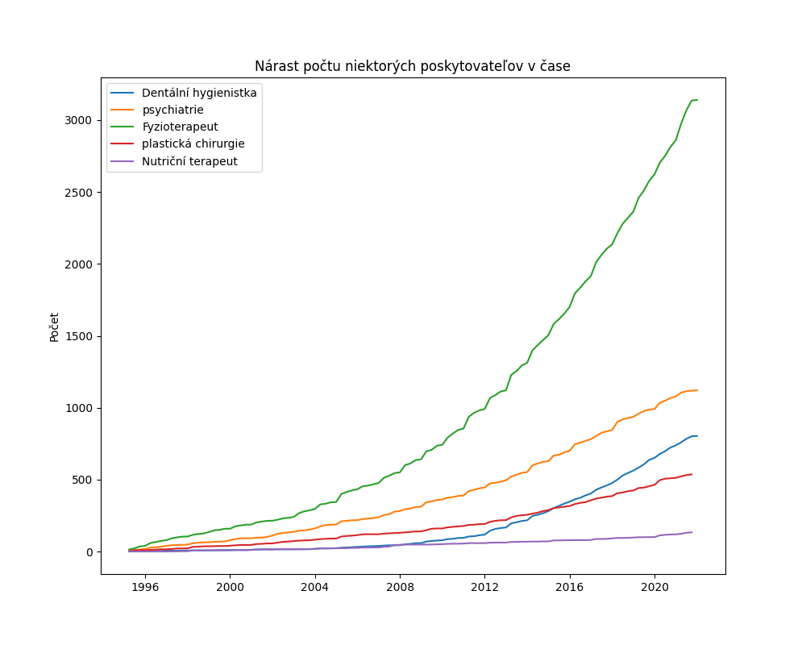
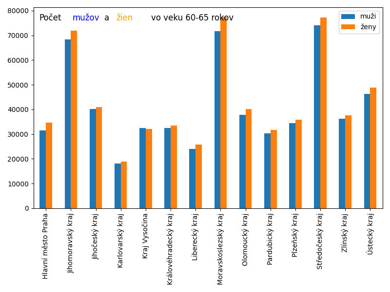
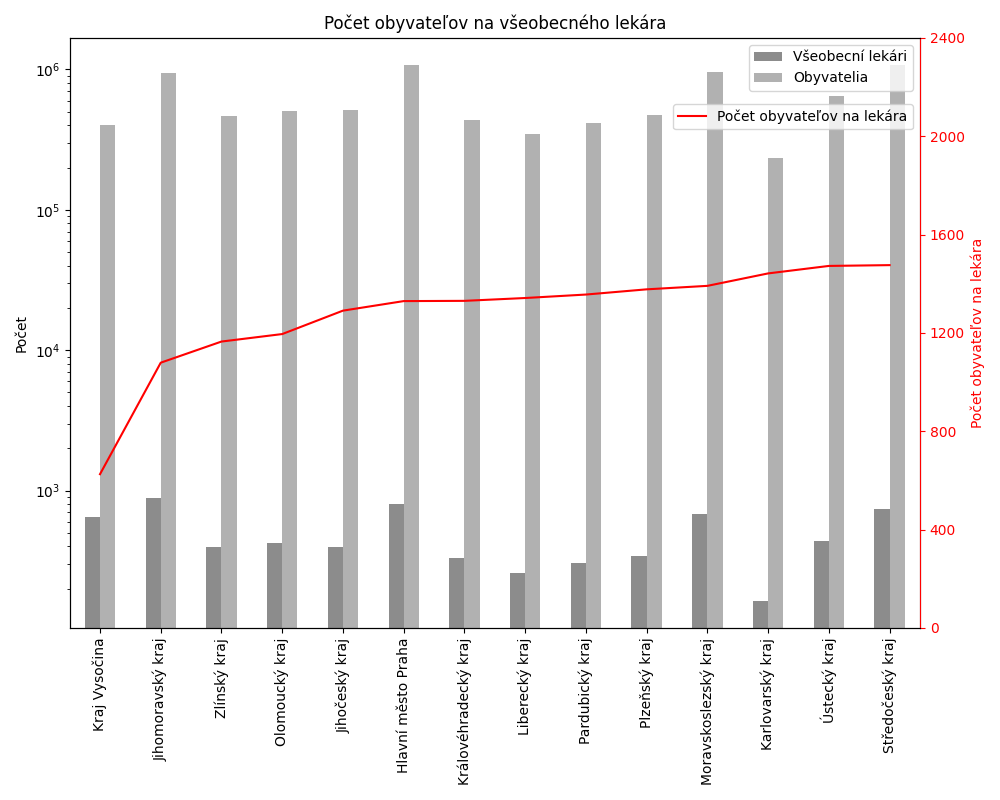
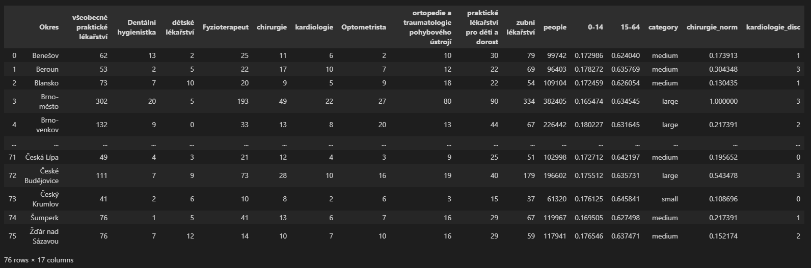

# BUT-FIT-UPA

Czech Republic healthcare data storage, preparation and analysis.

## Part 1
Loading data from Czech government website, cleaning and upload to NoSQL MongoDB.
> get_data.py

## Part 2
Data exploration, analysis and visualization.
> visualize.ipynb

### Bar charts comparing healthcare providers in the city of Brno and the rest of South-Moravian region for 15 different types of providers.

### Line plot displaying historical development in counts of 5 different types of providers.

### Comparison of number of czech people by sex in ages 20-25 and 60-65.

### Chart showing number of people by one general practitioner divided into regions.

### Map plotting of healthcare providers and clustering by cities.

The last part is data normalization, discretization and preparation of a dataset for a classificator.

